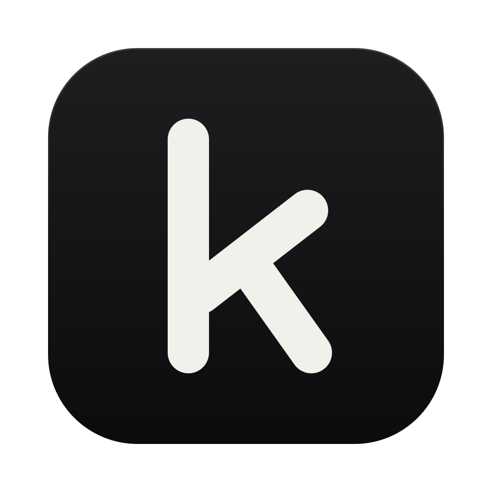
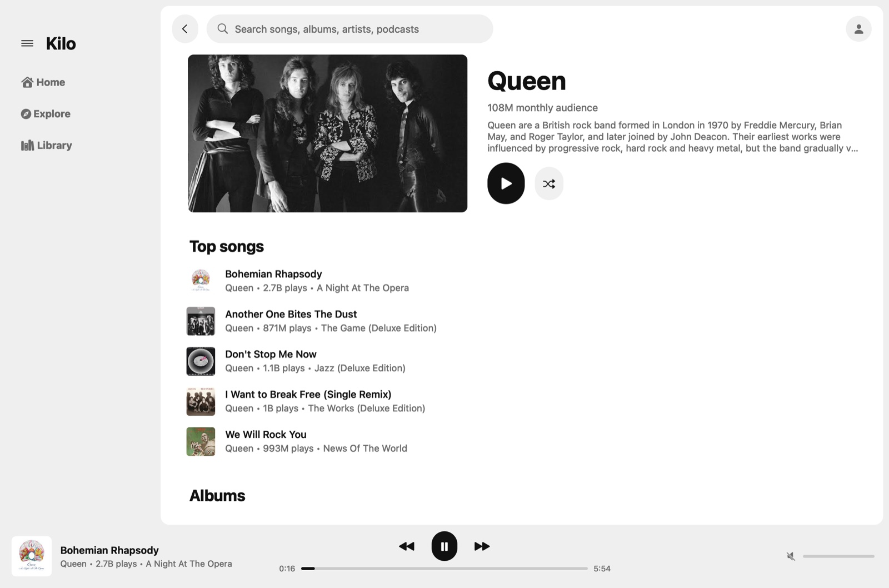
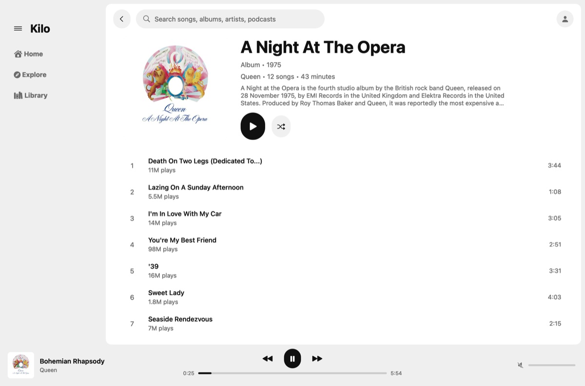
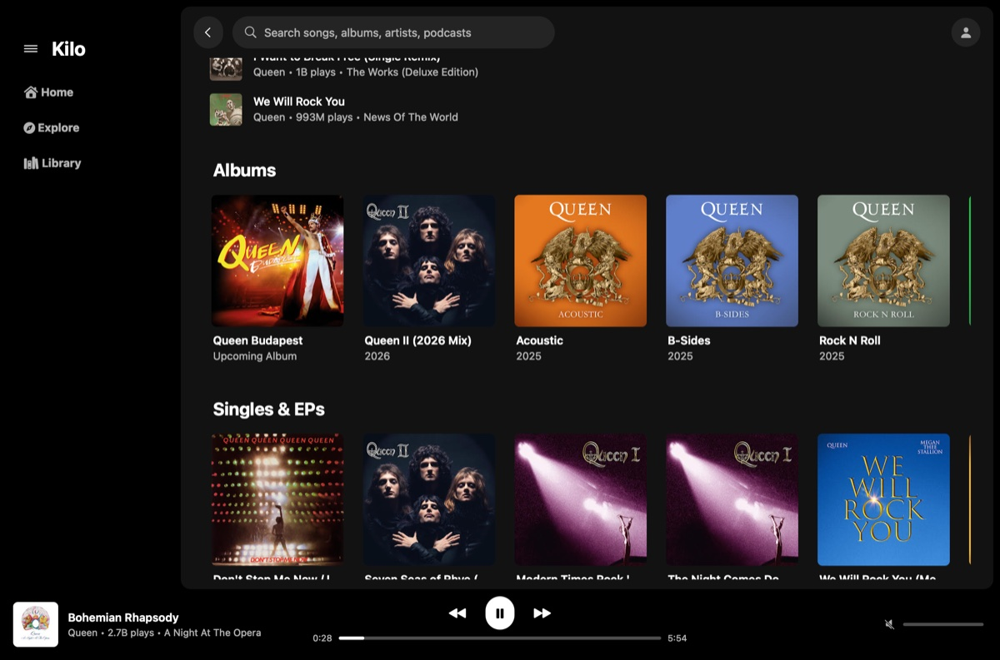

<p align="center">
  
</p>

<h1 align="center">Kilo</h1>

<p align="center">
  A very lightweight, unofficial YouTube Music client for the Mac.<br>
  Native AppKit, a small Rust core, and YouTube's own player doing the playing.<br>
  <b>Every single kilobyte counts.</b>
</p>

<p align="center">
  <a href="https://github.com/AlperKerimELMAS/KiloApp/actions/workflows/ci.yml"></a>
  
  <a href="LICENSE"></a>
</p>

<picture>
  <source media="(prefers-color-scheme: dark)" srcset="docs/images/artist-dark.jpg">
  
</picture>

## Why Kilo

YouTube Music on the desktop is a web page, and a web page in a browser
holds on to a lot of memory. Kilo draws its own native window, keeps only
what's on screen, and lets YouTube's own player do the playing, hidden, in
a helper that quits when you stop.

| | YouTube Music in Chrome | Kilo |
|---|---|---|
| Memory while playing | 1,088 MB | **147.5 MB** |
| Memory, window open, not playing | | **31 MB** |
| Paused for 5+ minutes | | **31 MB, 0% CPU** |
| CPU while playing (one core) | 8.9% | 8.2% |
| Home on screen after launch | | **0.15 s** |
| On disk | 1.4 GB (Chrome) | **1.5 MB** |

Measured on one Mac (Apple Silicon, macOS 27). [`docs/COMPARISON.md`](docs/COMPARISON.md)
says how, and what the numbers leave out.

> Kilo is an unofficial client. It isn't affiliated with, or endorsed by,
> YouTube or Google. YouTube and YouTube Music are trademarks of Google LLC.

## Features

- **Home, Explore and Library**, search, and album, playlist and artist
  pages, which open at once from a small cache once you've seen them.
- **Playback with a queue** that carries on with a radio when it runs out,
  as YouTube Music does. Play or shuffle a whole album or playlist, or start
  from any row.
- **Media keys and Control Center.** Music keeps playing with the window
  closed.
- **Light and dark**, following your Mac or your choice; **English and
  Turkish**.
- **Keyboard shortcuts** for everything (below), and VoiceOver support.
- **Sign in on Google's own page.** Kilo never sees your password, and
  keeps only YouTube's cookies.

<table>
  <tr>
    <td></td>
    <td></td>
  </tr>
</table>

## Status

Kilo 0.3 is an early release. It's a Mac app, and only a Mac app. There
are no prebuilt downloads yet: you build it yourself, in a minute or two
(below).

**Not there yet:** a Now Playing view with lyrics, a queue panel, liking
tracks and editing playlists. See the [roadmap](#roadmap).

## Requirements

- macOS 14 or later. Kilo is developed and tested on macOS 27, on Apple
  Silicon.
- A **YouTube Music Premium** account to play music. Without Premium you
  can browse and search; if an ad ever appears, Kilo stops playback rather
  than play it unseen.
- To build it: the Xcode Command Line Tools (`xcode-select --install`) and
  Rust, through [rustup](https://rustup.rs).

## Build and install

```sh
git clone https://github.com/AlperKerimELMAS/KiloApp.git
cd KiloApp
./packaging/macos/bundle.sh --install   # builds dist/Kilo.app and copies it to /Applications
```

The first build installs the Rust version pinned in `rust-toolchain.toml`.
Without `--install`, the app is left in `dist/Kilo.app` (`open dist/Kilo.app`).

The app is signed ad hoc, which is enough to run it on the Mac that built
it. It isn't notarized: build it on the Mac you'll use it on, rather than
copying a build from somewhere else.

To update, pull and run the same command again.

## Using Kilo

- **Signing in:** the welcome screen's button opens Google's own sign-in
  page, in a window of its own. If Google answers "This browser or app may
  not be secure", choose Try again: it usually goes through. Kilo asks you
  to sign in again about once a week (see Questions).
- **The account button** (top right) shows who's signed in, and has
  Appearance (System, Light, Dark), Language (System, English, Türkçe) and
  Sign Out. Appearance and Language are also in the View menu, and Sign
  Out in the Kilo menu.
- **Closing the window** doesn't stop the music; the Dock icon brings the
  window back. Five minutes after you pause, Kilo shuts its player down to
  give the memory back; pressing play starts it again where you left off
  (about 2 s).

### Keyboard shortcuts

The menus show them too. Plain keys (Space, M, the arrows) work whenever
you're not typing in the search field.

| Action | Keys |
|---|---|
| Play or pause | Space |
| Next, previous track | ⌘→, ⌘← |
| 10 seconds forward, back | → ← (or ⇧⌘→, ⇧⌘←) |
| Volume up, down | ⌘↑, ⌘↓ |
| Mute | M |
| Search | ⌘F, ⌘L, ⌘K or / |
| Leave the search field | Esc (clears it first) |
| Back | ⌘[, ⌥← or the mouse's back button |
| Home, Explore, Library | ⌘1, ⌘2, ⌘3 |
| Reload the page | ⌘R |
| Collapse or expand the sidebar (also ☰) | ⌃⌘S |
| Scroll | ↑ ↓, Page Up, Page Down, Home, End |

## How it works

- **A native UI.** AppKit, laid out by hand: only what's near the screen
  exists, and images are decoded at exactly the size they're drawn.
- **YouTube's own player plays the music,** in a hidden system web view, in
  a separate helper process. Kilo never downloads, captures or decodes
  media, and never blocks ads. Music videos play as their song version when
  there is one, which needs 41% less data.
- **The player goes when you stop.** Five minutes after you pause, the
  helper and all of WebKit are shut down, and Kilo is back to about 30 MB.
- **Instant pages.** Pages you've seen open from a small cache on disk, so
  Home is on screen 0.15 s after launch; ones older than half an hour
  refresh in the background.
- **Browsing** uses YouTube Music's web API with your own signed-in
  session, the way music.youtube.com does. That API isn't public, and
  YouTube can change it at any time; if something stops working after a
  YouTube update, please
  [open an issue](https://github.com/AlperKerimELMAS/KiloApp/issues).

How the pieces fit together, and the measurement behind each design
decision: [`docs/ARCHITECTURE.md`](docs/ARCHITECTURE.md).

## Privacy and security

- You sign in on Google's own page, in a system web view. Kilo never sees
  your password, and stores only YouTube's cookies, not Google's (for
  Gmail, Drive…).
- Kilo talks only to YouTube and Google, and adds no telemetry of its own.
  (YouTube's player reports what you play to YouTube, as it does on the
  website.)
- **Sign Out** (the account button, or the Kilo menu) deletes your session
  and everything Kilo stored on this Mac. To end the session at Google
  too, see [`docs/SECURITY.md`](docs/SECURITY.md).
- On disk, for the bundle id `io.github.alperkerimelmas.kilo`:
  - your session, in WebKit's cookie store
    (`~/Library/HTTPStorages/io.github.alperkerimelmas.kilo.binarycookies`);
  - music.youtube.com's page config
    (`~/Library/Application Support/io.github.alperkerimelmas.kilo`);
  - caches of thumbnails (up to 64 MB) and pages (16 MB), per sign-in
    (`~/Library/Caches/io.github.alperkerimelmas.kilo`);
  - your settings, in the defaults store
    (`defaults read io.github.alperkerimelmas.kilo`).

How Kilo protects your account, its known limitations, and how to report a
vulnerability: [`docs/SECURITY.md`](docs/SECURITY.md).

## Roadmap

Kilo will stay a Mac app. Next, roughly in this order:

- A Now Playing view: big art, Up next and lyrics.
- A queue panel, and the playing track marked in lists.
- Like and dislike, and adding to playlists.
- Media keys that work after the idle player has quit, and keyboard focus
  for cards and rows.
- Signed and notarized downloads, so you don't have to build Kilo yourself.
- More languages (a column in `crates/kilo-mac/src/strings.rs`; help is
  welcome).

Every feature has its memory and CPU cost measured before it's added.

## Questions

**Why only Premium?** Kilo plays music through YouTube's own player, hidden.
On a free account that player would show ads nobody sees: fake ad
impressions. So playback needs Premium, and Kilo stops if an ad appears.

**Will Kilo get downloads, ad blocking, or its own audio player?** No. Kilo
never downloads, captures or decodes YouTube's media; YouTube's player does
the playing. That's a deliberate line, not a missing feature.

**Will there be a Windows or Linux version?** No. Kilo is made for the Mac:
its UI is native AppKit, and it leans on what macOS already has (WebKit,
ImageIO, the system's TLS) instead of bringing its own.

**Why does Kilo ask me to sign in again every week?** Kilo keeps only
YouTube's cookies, never your Google account's (Gmail, Drive…), and Google
gives YouTube's a week. Renewing them would take your Google account's
cookies on disk, so Kilo asks instead.

**Why are there two "Kilo" processes in Activity Monitor?** While music
plays, the second one is the player helper. It exists only while you play,
and quits five minutes after you pause.

**How do I remove Kilo completely?** Choose Sign Out first (it deletes your
session and Kilo's files), quit, then delete `/Applications/Kilo.app`. To
drop your settings too: `defaults delete io.github.alperkerimelmas.kilo`.

## Contributing

Contributions are welcome. Please read
[`docs/CONTRIBUTING.md`](docs/CONTRIBUTING.md) first: Kilo has a few ground
rules (above all: it never touches media), and every efficiency change is
measured before it's kept.

- [`docs/ARCHITECTURE.md`](docs/ARCHITECTURE.md): how Kilo is built, and
  why, with the measurements.
- [`docs/COMPARISON.md`](docs/COMPARISON.md): the measured comparison with
  YouTube Music in Chrome.
- [`docs/CHANGELOG.md`](docs/CHANGELOG.md): what changed in each version.
- [`docs/SECURITY.md`](docs/SECURITY.md): what Kilo protects, and how to
  report a vulnerability.

## License

[MIT](LICENSE).
